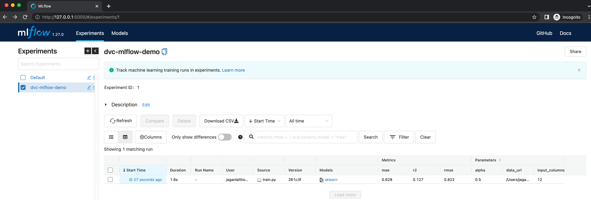
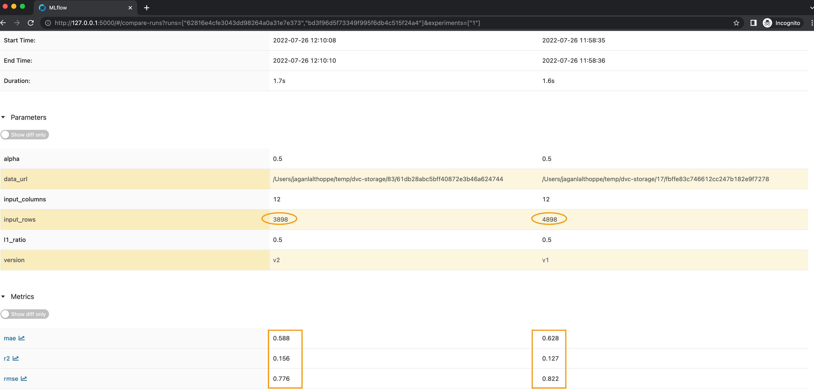

# Simple demo to use DVC & MLFlow
Data Versioning + Reproducible ML with DVC + MLflow

## Installation

### Clone the repo
```
git clone https://github.com/jaganlal/data_version_reproducible_ml.git
cd data_version_reproducible_ml/
```
## Prerequisite
1. VSCode - This project is developed using VSCode
2. Install `virtualenv` 
  ```
  python3 -m pip install --user virtualenv
  ```
3. Create a virtual environment
  ```
  python3 -m venv python_libs_env
  ```
4. Activate a virtual environment
  ```
  source python_libs_env/bin/activate
  ```

5. Install dependent libs
  ```
  pip3 install -r requirements.txt
  ```

## DVC Usage

### Initialize dvc
  ```
  dvc init
  ```
### Add remote data store
  ```
  dvc remote add -d data-store ~/temp/dvc-storage
  ```

*For demo, I'm using my temp folder, you can use `s3`, `azure`, `gdrive`.*
Checkout [remote api documentation](https://dvc.org/doc/command-reference/remote)
### To add a resource
  ```
  dvc add data/wine-quality.csv
  ```

### To push (to remote store)/pull (from remote store) a resource
  ```
  dvc push
  dvc pull
  ```

### Git best practices (tag a commit point)
As a best practice tag a commit using git command
  ```
  git add .
  git commit -m "data: added new dataset (wine-quality.csv)"
  git tag -a "v1" -m "Raw data"
  ```


## MLFlow
Refering the resource from DVC using [get_url](https://dvc.org/doc/api-reference/get_url)
  ```
  # Get url from DVC
  import dvc.api

  path = "data/wine-quality.csv"
  repo="{SOURCE-PATH}/data_version_reproducible_ml"
  version="v1" (pull from this tag `v1`)
  
  data_url = dvc.api.get_url(
    path=path,
    repo=repo,
    rev=version
  )
  ```


## Run the application

### Original Dataset
Once the about steps are completed, run
  ```
  python train.py
  ```

Fireup mlflow ui
  ```
  mlflow ui
  ```
And goto `http://127.0.0.1:5000/` on your browser, you should see


### Modified Dataset
For simplicity, let's delete 1000 rows from the dataset.
  ```
  sed -i .bak '2,1001d' data/wine-quality.csv
  ```
*Note: `sed` command might change if you're using other OS, the above is the macos command*

Run the following commands to push the update dataset both in DVC and git

  ``
  dvc add data/wine-quality.csv
  git add .
  git commit -m "data: removed 1000 lines”
  git tag -a "v2" -m "removed 1000 lines from wine-quality.csv"
  dvc push
  ``

Once the about steps are completed, modify the version (*from* **version="v1"** *to* **version="v2"**) in `train.py` and run
  ```
  python train.py
  ```

Fireup mlflow ui
  ```
  mlflow ui
  ```
And goto `http://127.0.0.1:5000/` on your browser or refresh, you should see new metrics, when you compare both models you'll see the following differences
